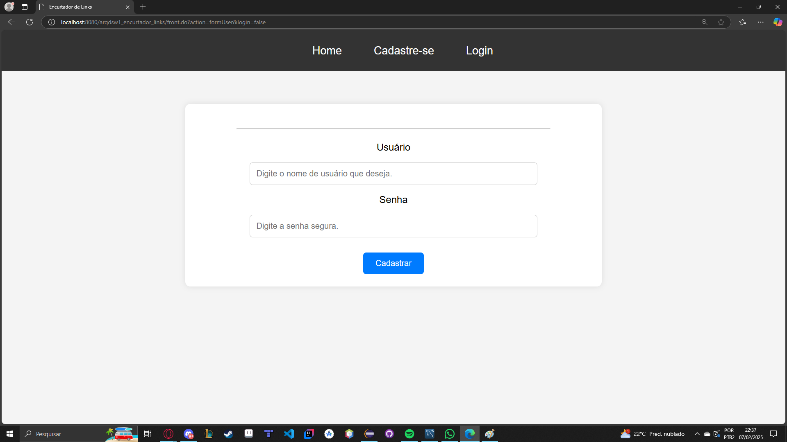
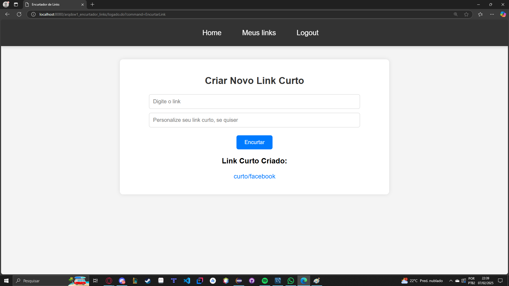
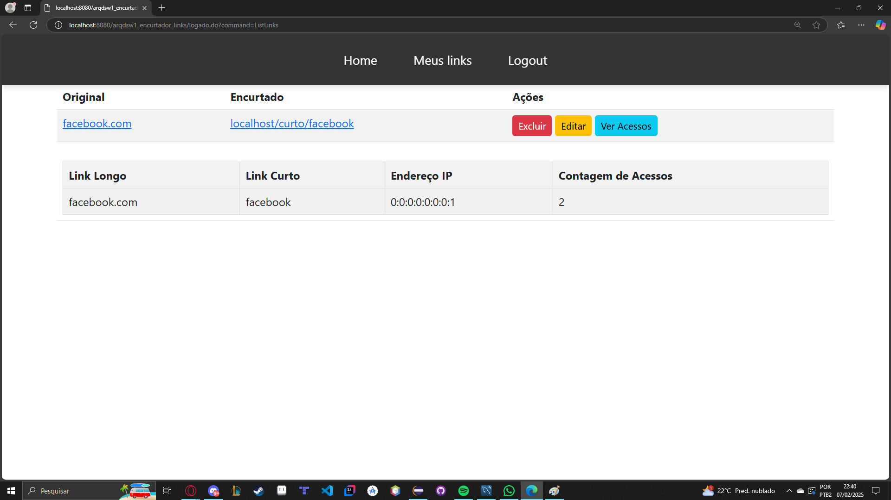
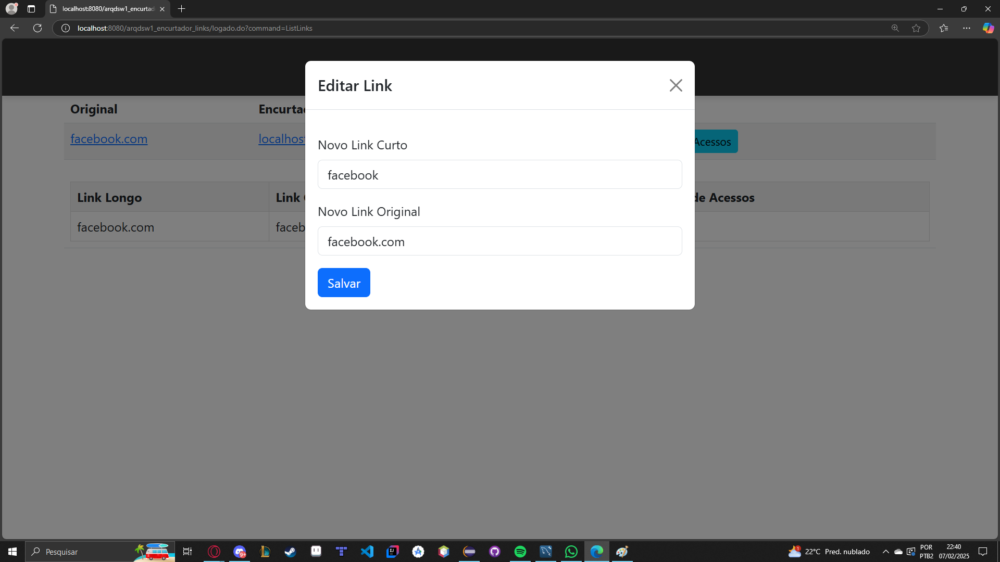

# Encurtador de Links
O Encurtador de Links é uma aplicação web que permite a criação e gerenciamento de links curtos, oferecendo funcionalidades para usuários autenticados e visitantes anônimos. 
Com ele, é possível criar links curtos personalizados ou gerados automaticamente, visualizar estatísticas de acesso e gerenciar links de forma simples e segura.
Este encurtador foi criado como atividade e entrega final para disciplina de Desenvolvimento de Sistemas Web do curso de ADS do IFSP.

========================================================================

# Requisitos Funcionais
Código	Descrição
RF01	Cadastro de novos usuários.
RF02	Login e logout de usuários.
RF03	Criação de links curtos de forma aberta.
RF04	Criação de links curtos vinculados a usuários logados.
RF05	Criação de links curtos personalizados.
RF06	Validação de identificadores de links curtos.
RF07	Redirecionamento direto para URLs longas.
RF08	Página de erro para links inexistentes.
RF09	Visualização de estatísticas de acesso.
RF10	Visualização de IPs dos visitantes.
RF11	Alteração de URLs longas e identificadores.
RF12	Exclusão de links curtos.
RF13	Impedimento de links curtos duplicados.
RF14	Restrição de acesso a estatísticas e gerenciamento para usuários logados.

========================================================================

# Screenshots
## Tela de Cadastro

## Tela de Login

## Criação de Link Curto

## Estatísticas de Acesso

## Gerenciamento de Links

========================================================================

# Tecnologias Utilizadas
Frontend: HTML, CSS, JavaScript, Bootstrap.
Backend: Java (JSP/Servlets).
Banco de Dados: MySQL.
Ferramentas: Maven, Git, Eclipse IDE.

========================================================================

# Contato
Para dúvidas ou sugestões, entre em contato:
Nome: Deivid Brito | Email: deivid.brito@aluno.ifsp.edu.br
Nome: João Andolpho | Email: joao.andolpho@aluno.ifsp.edu.br
